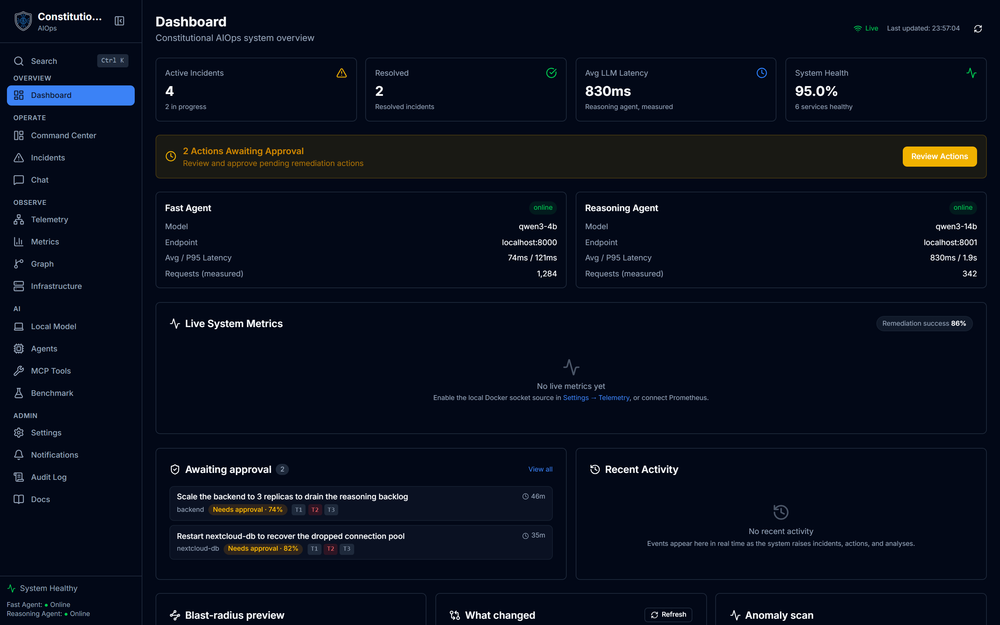
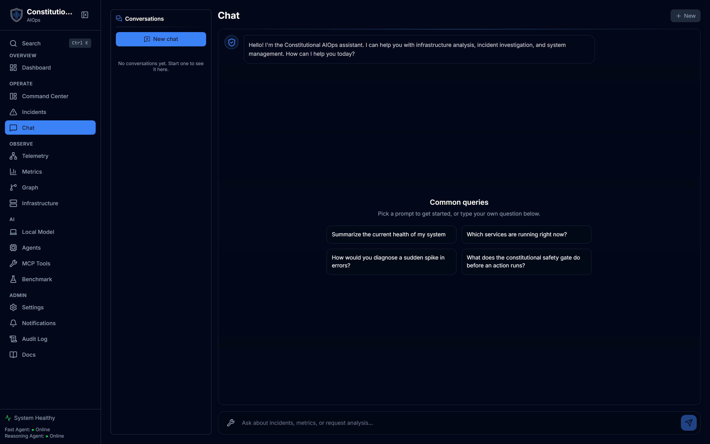
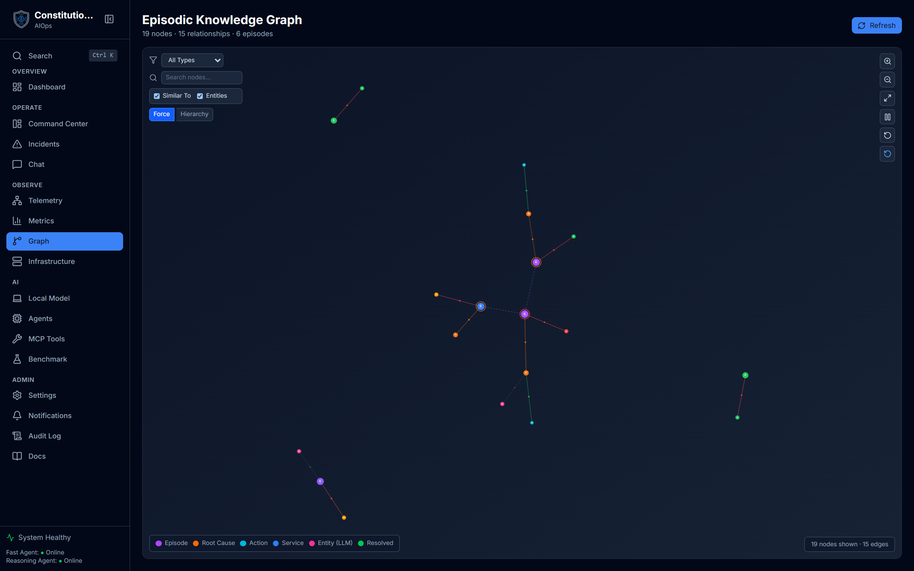
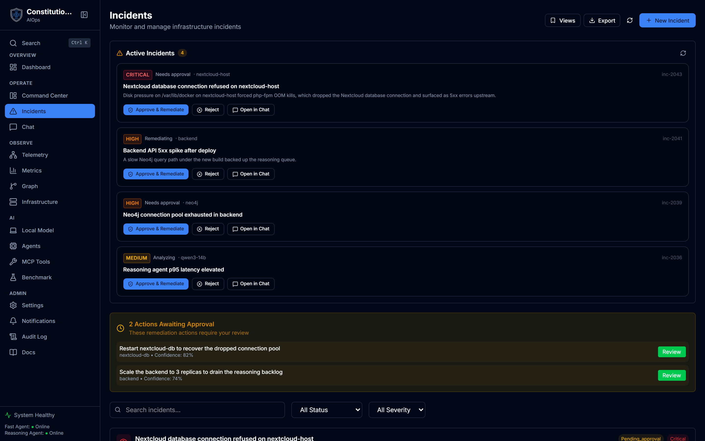
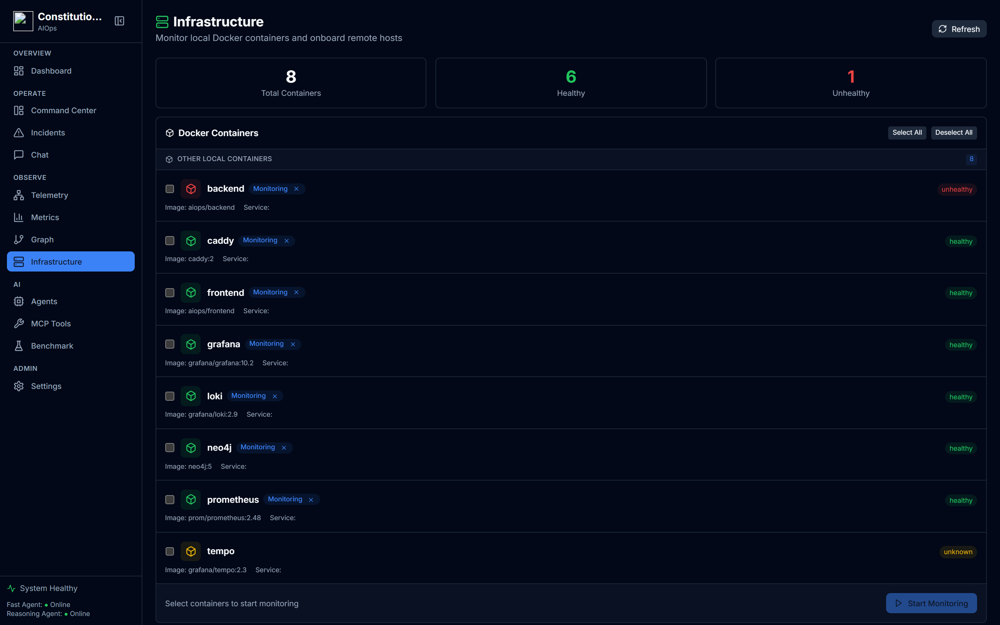

<div align="center">


# Constitutional AIOps

### Autonomous infrastructure operations with a constitution it cannot break

Two LLM agents read your telemetry and propose fixes. Every one clears a
12-principle safety gate before it can run.

[**Open the live app →**](https://aiops.imaginaerium.in) &nbsp;·&nbsp; [Live demo](https://aiops.imaginaerium.in/demo/index.html) &nbsp;·&nbsp; [Docs](docs/) &nbsp;·&nbsp; [By Imaginaerium](https://imaginaerium.in)

[](LICENSE)
[](https://www.python.org/)
[](https://fastapi.tiangolo.com/)
[](https://react.dev/)
[](https://www.typescriptlang.org/)
[](https://www.docker.com/)



</div>

---

> [!IMPORTANT]
> **Autonomous remediation is off by default.** Every proposed action is checked
> against a 12-principle constitutional gate, and above the confidence line it
> still queues for a human Approve/Reject before anything runs. This is an
> academic engineering research project, not a hardened commercial product. Point
> it at systems you are comfortable experimenting on, and read
> [the safety model](#-the-constitutional-safety-model) before enabling action tools.

---

## 📑 Table of contents

- [What it is](#-what-it-is)
- [Key features](#-key-features)
- [Screenshots](#-screenshots)
- [The constitutional safety model](#-the-constitutional-safety-model)
- [Quick start (lite self-host)](#-quick-start-lite-self-host)
- [Deployment options](#-deployment-options)
- [Tech stack](#-tech-stack)
- [Architecture](#-architecture)
- [Project structure](#-project-structure)
- [Documentation](#-documentation)
- [Development](#-development)
- [Contributing](#-contributing)
- [License](#-license)
- [Credits](#-credits)

---

## 🧩 What it is

Constitutional AIOps is a self-hosted system that watches your infrastructure
telemetry, reasons about what is going wrong, and proposes remediation, with a
safety framework it is not allowed to break.

Two LLM agents split the work. A **fast agent** annotates and classifies the
stream of logs, metrics, and traces. A **reasoning agent** does root-cause
analysis, drafts a remediation plan, and handles the human chat. Every action
the system might take is scored for confidence and run through a constitutional
gate first. High-confidence actions are audited, mid-confidence actions wait for
your approval, and low-confidence ones only raise an alert.

The defining trait is **bring your own endpoint**: both agents point at any
OpenAI-compatible LLM API (vLLM, Ollama, AWS Bedrock, OpenAI, and so on), and
they can share a single endpoint for a minimal setup. There is no bundled model
and no required GPU. The research reference configuration runs Qwen3-4B (fast)
and Qwen3-14B (reasoning) co-resident on one 24GB GPU, but that is a reference,
not a requirement.

---

## ✨ Key features

- 🏛️ **Constitutional safety gate** — 12 principles across 3 tiers. Tier 1
  (safety) is never violated, Tier 2 (operational) needs approval, Tier 3
  (learning) is a soft guideline. Every action passes through it.
- 🤖 **Dual-agent architecture** — a fast annotation agent and a deep reasoning
  agent, each pointed at any OpenAI-compatible endpoint. Both can share one
  endpoint for a minimal deploy.
- 🙋 **Human-in-the-loop remediation** — action tools never fire inside the model
  loop. Proposals queue as an Approve/Reject card in chat. Settings pick
  diagnose / approve / auto per tool, and everything is audit-logged.
- 🧠 **Graph-episodic memory** — an optional Neo4j store correlates incidents and
  feeds past resolutions back into reasoning (omitted in the lite profile).
- 📡 **Unified observability** — logs, metrics, and traces through the LGTM stack
  (Loki, Grafana, Tempo, Prometheus) plus an OpenTelemetry collector.
- 💬 **ChatOps alerting** — outbound and inbound relay for Telegram and Matrix,
  with cost fencing on the LLM spend.
- 🔑 **Multi-tenant, bring-your-own-key** — per-user LLM credentials, public
  signup (with Turnstile), and an optional in-browser WebLLM path.
- 🧩 **Extensible** — a Python SDK, personal access tokens, and a fail-closed
  plugin loader that routes plugin actions through the same constitutional gate.
- 🐳 **One-command self-host** — a lite Docker Compose profile runs the whole
  thing with no GPU and no bundled models.
- 🖥️ **No-login demo** — a static demo build runs the real UI from bundled
  fixtures, so you can click around before deploying anything.

---

## 📸 Screenshots

The dashboard is shown at the top of this README. A few more of the surfaces
(there are more in [`marketing/public/screenshots/`](marketing/public/screenshots/)):

| | |
|---|---|
| **Chat + remediation** | **Graph-episodic memory** |
|  |  |
| **Incidents** | **Infrastructure** |
|  |  |

Or try the whole thing live: **[the no-login demo](https://aiops.imaginaerium.in/demo/index.html)**.

---

## 🏛️ The constitutional safety model

Every candidate action gets a confidence score, then a tier decides who has to
sign off.

**Authorization matrix**

| Confidence | Action | Human review |
|---|---|---|
| > 0.90 | Automatic | Audit only |
| 0.70 – 0.90 | Approval required | Must approve |
| < 0.70 | Alert only | Notify only |

**Principle tiers (12 total)**

- **Tier 1 — Safety (never violate):** no data deletion without confirmation,
  keep a minimum of healthy replicas, no cascade affecting many services, and
  every action reversible within 60 seconds.
- **Tier 2 — Operational (approval to override):** prefer minimal intervention,
  require evidence, check historical precedent, and degrade gracefully rather
  than shut down.
- **Tier 3 — Learning (soft guidelines):** attribute outcomes to actions, analyze
  failures, reinforce what worked, and keep solution diversity.

The confidence score itself blends model self-confidence, historical success
rate, and similarity to past incidents:

```
C(a) = 0.40 · C_LLM(a) + 0.35 · C_hist(a) + 0.25 · C_sim(a)
```

---

## 🚀 Quick start (lite self-host)

The recommended self-host is the **lite** profile: backend, frontend, and your
own OpenAI-compatible LLM endpoint. No GPU, no bundled models, no Neo4j. Full
guide in [`docs/DEPLOYMENT.md`](docs/DEPLOYMENT.md).

**Prerequisites:** Docker and Docker Compose v2, an OpenAI-compatible LLM
endpoint, and roughly 2GB RAM plus 20GB disk.

```bash
# Clone
git clone https://github.com/Partha-dev01/Constitutional-AIOps.git constitutional-aiops
cd constitutional-aiops

# Configure your LLM endpoint (both agents may share one URL + model)
cp .env.example .env
#   set FAST_AGENT_URL / REASONING_AGENT_URL / *_MODEL, and LLM_API_KEY if the
#   endpoint needs a bearer token.

# Start
docker compose -f docker/docker-compose.lite.yml up -d

# Open http://localhost:3000  (backend API docs at http://localhost:8000/docs)
```

---

## 🧰 Deployment options

| Mode | GPU | LLM | Best for |
|---|---|---|---|
| **Lite self-host** | None | Your own OpenAI-compatible endpoint | Most self-hosters |
| **Local development** | None | Mock (no external calls) | Working on the code |
| **Full GPU stack** | One 24GB GPU | Two co-resident models (research reference) | Reproducing the paper |

The lite profile is what the hosted instance at
[aiops.imaginaerium.in](https://aiops.imaginaerium.in) runs. Compute sleeps when
idle, so there is no fixed running cost beyond a small always-on VM.

```bash
# Local development (mock LLM, no external calls)
docker compose -f docker-compose.yml -f docker/docker-compose.local.yml up -d

# Full GPU stack (research reference: two models on one 24GB GPU + Neo4j + LGTM)
cp .env.production.example .env   # set NEO4J_PASSWORD, AUTH_*, WS_TOKEN, ...
docker compose -f docker-compose.yml -f docker/docker-compose.gpu.yml up -d
```

---

## 🛠️ Tech stack

| Area | Technology |
|---|---|
| Backend | FastAPI (Python 3.11+), 21 API routers, OpenAPI 3.1 |
| Frontend | React 18 + TypeScript 5 + Tailwind CSS 4 + Vite 8 |
| LLM runtime | Any OpenAI-compatible endpoint (vLLM, Ollama, AWS Bedrock, OpenAI, ...) |
| Graph memory | Neo4j 5.x (optional; omitted in lite) |
| Observability | Loki, Grafana, Tempo, Prometheus + OpenTelemetry |
| Packaging | Docker Compose (lite / local / GPU / production profiles) |
| SDK | Python client + generated TypeScript types |
| Testing | pytest (backend), Vitest + Playwright (frontend) |

---

## 🏗️ Architecture

Telemetry flows in, the two agents annotate and reason over it, and every
proposed action is gated before it can touch anything.

```
  logs · metrics · traces
            │
            ▼
   ┌──────────────────┐      ┌───────────────────┐
   │   Fast agent     │      │  Reasoning agent  │
   │  annotate +      │─────▶│  root-cause +     │
   │  classify        │      │  remediation plan │
   └──────────────────┘      └─────────┬─────────┘
            ▲                          │
            │                          ▼
   ┌────────┴─────────┐      ┌───────────────────┐
   │  Graph-episodic  │◀────▶│  Constitutional   │
   │  memory (Neo4j)  │      │  gate: 12 / 3 tier│
   └──────────────────┘      └─────────┬─────────┘
                                       │
                       ┌───────────────┴───────────────┐
                       ▼               ▼                ▼
                  auto (audit)   approve/reject     alert only
```

Self-hosters run the **lite** profile (backend + frontend + your endpoint, no
GPU, no Neo4j). The research reference config puts both models on one 24GB GPU
with vLLM AWQ. See [`docs/ARCHITECTURE.md`](docs/ARCHITECTURE.md) for the full
design.

---

## 🗂️ Project structure

```
constitutional-aiops/
├── src/                     # Python backend (FastAPI)
│   ├── agents/              # Fast annotator + reasoning agent, model router
│   ├── constitutional/      # 12-principle safety framework + validator
│   ├── memory/              # Neo4j graph-episodic memory
│   ├── telemetry/           # OpenTelemetry ingestion
│   ├── benchmark/           # Benchmark runner + evaluator (generic engine)
│   └── api/                 # REST routes
├── frontend/                # React + TypeScript dashboard (Vite)
├── marketing/               # Standalone static marketing site
├── sdk/                     # Python SDK + TypeScript types
├── docker/                  # Compose profiles (lite / local / gpu / production)
├── docs/                    # Documentation
└── tests/                   # Test suite
```

---

## 📚 Documentation

| Document | Contents |
|---|---|
| [`docs/DEPLOYMENT.md`](docs/DEPLOYMENT.md) | Self-host and deployment guide |
| [`docs/ARCHITECTURE.md`](docs/ARCHITECTURE.md) | System design and data flow |
| [`docs/API.md`](docs/API.md) | REST API reference |
| [`docs/BACKEND.md`](docs/BACKEND.md) | Python backend reference |
| [`docs/FRONTEND.md`](docs/FRONTEND.md) | React frontend reference |
| [`docs/INDEX.md`](docs/INDEX.md) | Full documentation index |

---

## 🧑‍💻 Development

```bash
# Backend
pytest tests/ -v                       # tests
pytest tests/ --cov=src                 # with coverage
black src/ && isort src/                # format
ruff check src/                         # lint

# Frontend
cd frontend
npm install
npm run dev                             # dev server on :3000
npm run test                            # Vitest
npm run lint                            # ESLint
```

Key environment variables are documented in `.env.example` (lite) and
`.env.production.example` (full stack).

---

## 🤝 Contributing

Contributions are welcome. A few ground rules:

- Keep changes accurate and honest. Never overstate what the safety gate
  guarantees.
- Do not commit secrets. `.env*` files are gitignored.
- Run the backend and frontend test suites and the linters before opening a PR.
- Shared `src/` fixes should hold across the lite, local, and GPU profiles.

---

## 📄 License

Licensed under the **GNU Affero General Public License v3.0** (AGPL-3.0). See
[`LICENSE`](LICENSE) for the full text.

Copyright (C) 2026 Partha-dev01.

Because this project is AGPL-licensed, if you run a modified version as a network
service you must offer its users the corresponding source of your modified
version.

---

## 🙏 Credits

Built by **[Imaginaerium](https://imaginaerium.in)**.

- Live app: https://aiops.imaginaerium.in
- No-login demo: https://aiops.imaginaerium.in/demo/index.html
- Repository: https://github.com/Partha-dev01/Constitutional-AIOps
