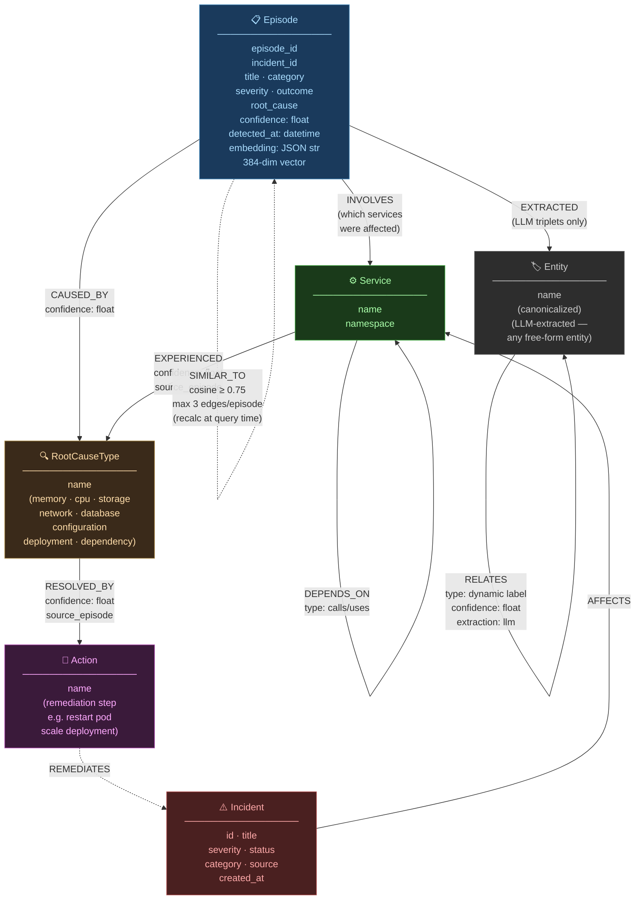
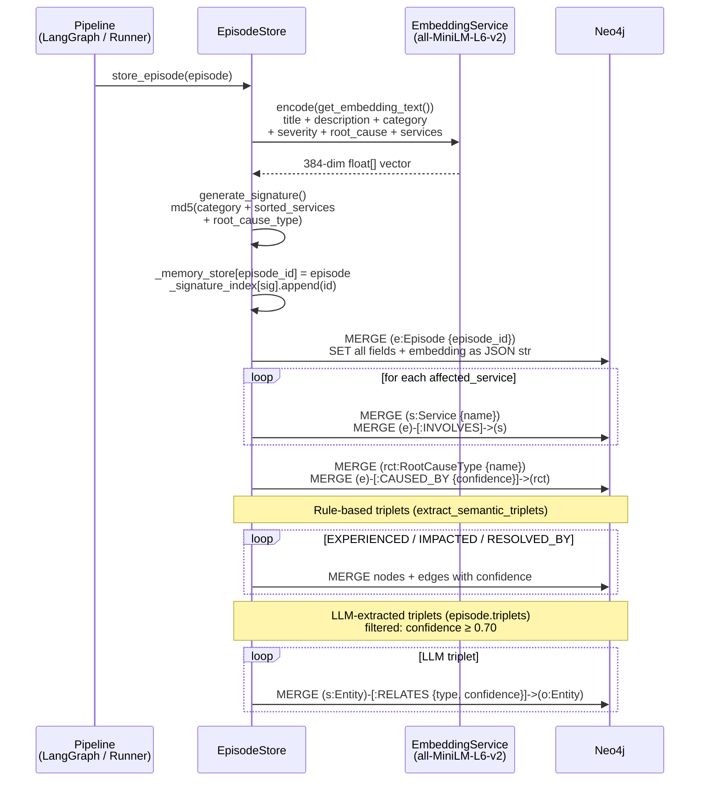
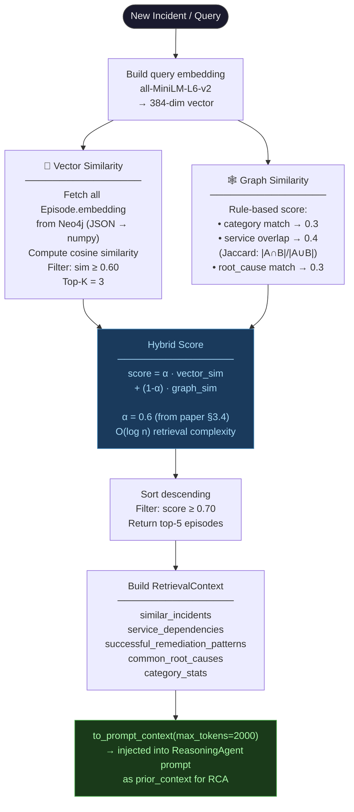

# Graph-Episodic Memory System

**Source**: `src/memory/episode_store.py`, `src/memory/neo4j_client.py`, `src/memory/retrieval.py`
**Inspiration**: AriGraph dual-memory architecture (semantic + episodic)
**Storage**: Neo4j 5.x (Community Edition, bolt://localhost:7687)

---

## Neo4j Node & Edge Schema



---

## How an Episode Gets Stored



---

## How Retrieval Works (Hybrid)



---

## Triplet Types — Explained

| Relationship | Source → Target | Extracted by | Example |
|---|---|---|---|
| `INVOLVES` | Episode → Service | Rule (affected_services list) | episode_42 → payment-svc |
| `CAUSED_BY` | Episode → RootCauseType | Rule (_extract_root_cause_type) | episode_42 → memory |
| `EXPERIENCED` | Service → RootCauseType | Rule (service × root_cause_type) | payment-svc → memory |
| `IMPACTED` | Service → Service | Rule (primary → each other affected) | payment-svc → order-svc |
| `RESOLVED_BY` | RootCauseType → Action | Rule (successful_actions) | memory → restart pod |
| `RELATES` | Entity → Entity | **LLM-extracted** (confidence ≥ 0.70) | OOM → heap exhaustion |
| `EXTRACTED` | Episode → Entity | LLM triplets traceability | episode_42 → OOM |
| `SIMILAR_TO` | Episode → Episode | Computed at query time (cosine ≥ 0.75, max 3/node) | episode_42 → episode_17 |
| `DEPENDS_ON` | Service → Service | Service topology / traces | frontend → auth-svc |
| `AFFECTS` | Incident → Service | Incident management API | INC-001 → db-replica |

---

## Semantic Triplet Extraction (AriGraph Pattern)

Each episode produces two classes of triplets:

**1. Rule-based** — deterministic, always produced:
```
for service in episode.affected_services:
    (service)  -[EXPERIENCED]->  (root_cause_type)

for i in causal_chain[:-1]:
    (causal_chain[i])  -[CAUSED]->  (causal_chain[i+1])

for dependent in affected_services[1:]:
    (primary_service)  -[IMPACTED]->  (dependent)

for action in successful_actions:
    (root_cause_type)  -[RESOLVED_BY]->  (action)
```

**2. LLM-extracted** — dynamic labels, stored as `Entity -[:RELATES {type}]-> Entity`:
- Produced by `FastAnnotator` during annotation
- Filtered: `confidence ≥ MIN_TRIPLET_CONFIDENCE (0.70)`
- Entities are canonicalized before storage to prevent duplicates
- Stored with `extraction_method: 'llm'` tag on the edge

---

## Graph Degree Caps (anti-hairball, v0.6.0)

| Constant | Value | Purpose |
|---|---|---|
| `SIMILAR_TO_THRESHOLD` | 0.75 cosine | Minimum to draw a SIMILAR_TO edge |
| `MAX_SIMILAR_EDGES_PER_EPISODE` | 3 | Prevents a single episode linking to everything |
| `MIN_TRIPLET_CONFIDENCE` | 0.70 | Filters low-quality LLM triplets |
| `MAX_EDGES_PER_NODE` | 5 | Global degree cap (Graph Explorer) |

---

## Current Graph State (Post Phase 4.4, 2026-05-13)

| Label | Count |
|---|---|
| Episode | 431 |
| Service | 49 |
| RootCauseType | 8 |
| **INVOLVES** edges | 531 |
| **CAUSED_BY** edges | 431 |
| **EXPERIENCED** edges | 531 |
| **IMPACTED** edges | 100 |

Populated in 28 seconds via `scripts/populate_neo4j.py` from `benchmark_431_seed42.json`.
Embedding: `sentence-transformers/all-MiniLM-L6-v2` (384-dim), stored as JSON string in `Episode.embedding` (Neo4j Community Edition has no native vector type — cosine similarity computed in Python/numpy at query time).
