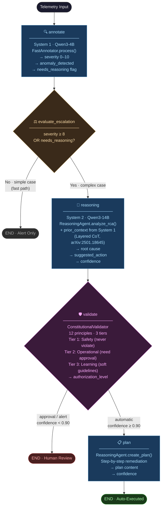

# LangGraph Orchestration Pipeline

**Source**: `src/orchestration/graph.py`
**Reference**: Talker-Reasoner architecture — Christakopoulou et al., Google DeepMind (arXiv:2410.08328)

---

## Pipeline Diagram



---

## Component Breakdown

### Nodes (5 total)

| Node | Agent | Model | What it does |
|------|-------|-------|-------------|
| `annotate` | `FastAnnotator` | Qwen3-4B | Classifies telemetry, detects anomalies, assigns severity 0–10 |
| `evaluate_escalation` | _(logic only)_ | — | Gate: escalate if `severity ≥ 8` OR `needs_reasoning=True` |
| `reasoning` | `ReasoningAgent` | Qwen3-14B | Deep RCA with CoT context passed from System 1 |
| `validate` | `ConstitutionalValidator` | — | Checks 12 principles across 3 tiers, sets authorization level |
| `plan` | `ReasoningAgent` | Qwen3-14B | Generates step-by-step remediation plan |

### Conditional Edges (2 total)

**Edge 1 — Escalation gate** (after `evaluate_escalation`):
- `needs_reasoning = False` → fast-path END (no Qwen3-14B invoked, lower latency)
- `needs_reasoning = True` → full System 2 pipeline

**Edge 2 — Authorization gate** (after `validate`):
- `automatic` (confidence ≥ 0.90) → auto-generate and execute plan
- `approval_required` (0.70–0.90) → END, human must approve
- `alert_only` (< 0.70) → END, notify only

### Shared State (`IncidentState`)

LangGraph merges each node's return dict into a single `TypedDict` that flows through the whole pipeline. Key fields:

```
telemetry_data        → raw input
severity              → 0–10 score from System 1
annotation_content    → text output of System 1
prior_context         → CoT context built from System 1, fed into System 2
rca_result            → root cause + suggested_action from System 2
authorization_level   → "automatic" | "approval" | "alert"
confidence            → composite score C(a) = α·C_LLM + β·C_hist + γ·C_sim
steps_completed       → breadcrumb trail ["annotate", "reasoning", ...]
latency_ms            → per-stage timing dict
```

---

## Key Design Decisions

**LangGraph wraps existing agents — no new LLM code.**
`FastAnnotator`, `ReasoningAgent`, and `ConstitutionalValidator` were built independently. LangGraph only orchestrates them with conditional routing logic.

**Cross-agent Chain-of-Thought.**
The `reasoning` node receives `prior_context` built from System 1's output (severity, category, annotation text). This is the Layered CoT pattern (arXiv:2501.18645) — System 2 reasons on top of System 1's conclusions, not from scratch.

**Constitutional AI as a hard gate.**
The validator runs before any action is executed. Tier 1 safety principles (e.g., no data deletion without confirmation, maintain ≥2 healthy replicas) can never be overridden by confidence score.

**This is the `with-orchestrator` ablation config.**
The default benchmark (`full` config) uses direct async calls to the same agents without LangGraph overhead. The ablation compares the two to measure orchestration cost vs. benefit.
